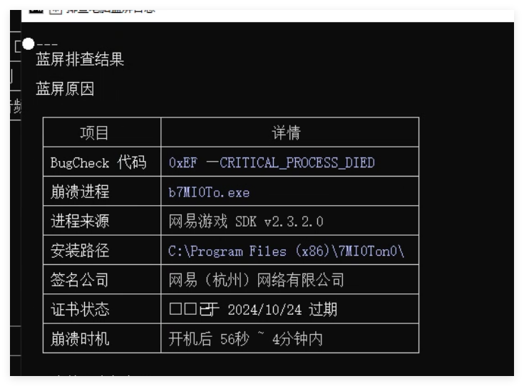
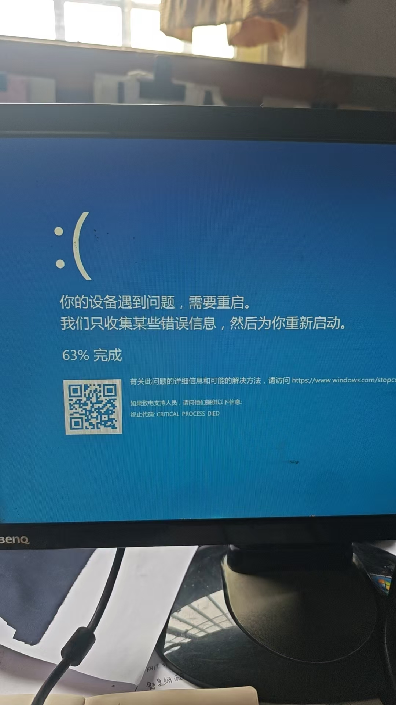

# 恶意软件分析报告

> **发现时间**: 2026-05-30
> **发现场景**: 排查 Windows 蓝屏 (BSOD) 问题时，在桌面上发现可疑目录 `7MI0Ton0`

## 蓝屏截图





相关 dump 文件均已打包至 `minidump.zip` 中，可供进一步分析。

---

## 文件清单

| 文件名 | 大小 | 类型 | 风险 |
|--------|------|------|------|
| `b7MI0To.exe` | 398 KB | PE32 可执行文件 (GUI) | 中 — 签名合法但被利用 |
| `libcef.dll` | 500 MB | PE32 DLL | **高 — 核心恶意载荷** |
| `MSVCP140.dll` | 436 KB | VC++ 运行时 | 低 — 微软合法签名 |
| `VCRUNTIME140.dll` | 79 KB | VC++ 运行时 | 低 — 微软合法签名 |
| `t3d.tmp` | 340 KB | Zip 压缩包（投放器） | 高 |
| `t4d.tmp` | 11.4 MB | BMP 位图（疑似隐写） | 中 |
| `templateWatch.dat` | 887 KB | 加密/混淆数据 | 中 |

## 分析详情

### 1. 核心恶意载荷: `libcef.dll`

这是整个恶意软件的关键组件，伪装成 Chromium Embedded Framework (CEF) 库：

- **无数字签名** — 正版 libcef.dll 由 Google/The Chromium Authors 签名
- **原始文件名**: `qpglxt.EXE`（拼音缩写：棋牌管理系统）
- **版本信息**: 通用 MFC 模板，非 CEF 官方信息
- **编译模式**: Debug — 正式发布不会使用调试版本
- **体积异常**: 500 MB，远超正版 CEF 库（通常 100-200 MB），多余部分可能捆绑了恶意载荷
- **SHA256**: `bf7d70c9f89fdf811fb4cfc9569cd3e0b238e5bbce52d431871bd63a9a45ab4e`

### 2. 合法签名的宿主程序: `b7MI0To.exe`

- **签名方**: 网易（杭州）网络有限公司 (NetEase)，DigiCert 签名，签名有效
- **版本信息**: "网易游戏SDK" v2.3.2.0
- **用途**: 作为合法的已签名程序，用于加载同目录下的 DLL，绕过安全软件检测
- **SHA256**: `269431f14a074d8b6ad307928b3a57cf0e6c8b400fb6511f25fdfcf5546348ac`

### 3. 投放器: `t3d.tmp`

Zip 压缩包，内含以下文件（与目录中文件一一对应）：

```
text/text.exe           (398,336 bytes)
text/MSVCP140.dll       (436,600 bytes)
text/VCRUNTIME140.dll   (79,792 bytes)
```

用于解压部署恶意文件到目标目录。

### 4. 其他可疑文件

- **`t4d.tmp`**: BMP 位图文件 (1731x1731 像素)，可能通过隐写术 (steganography) 隐藏额外数据
- **`templateWatch.dat`**: 加密/混淆的二进制数据，用途不明，可能为配置文件或附加载荷

## 攻击手法

采用经典的 **DLL 劫持 (DLL Hijacking)** 技术：

1. 用户被诱导下载该目录（伪装为游戏辅助/棋牌外挂等）
2. 运行 `b7MI0To.exe`（合法签名的网易游戏 SDK）
3. 程序启动时自动加载同目录下的 `libcef.dll`
4. 由于 Windows DLL 搜索顺序，优先加载了当前目录下被篡改的 `libcef.dll`
5. 恶意代码通过合法进程执行，绕过安全软件检测

## 建议处置

1. **不要运行** 该目录下的任何可执行文件
2. 使用杀毒软件对系统进行**全盘扫描**
3. 检查是否存在可疑的网络连接、计划任务或启动项
4. 如需进一步确认，可将 `libcef.dll` 的 SHA256 提交至 [VirusTotal](https://www.virustotal.com) 查询

## IOC (Indicators of Compromise)

```
目录名:    7MI0Ton0
文件哈希:
  b7MI0To.exe        269431f14a074d8b6ad307928b3a57cf0e6c8b400fb6511f25fdfcf5546348ac
  libcef.dll         bf7d70c9f89fdf811fb4cfc9569cd3e0b238e5bbce52d431871bd63a9a45ab4e
  MSVCP140.dll       885a0a146a83b0d5a19b88c4eb6372b648cfaed817bd31d8cd3fb91313dea13d
原始文件名: qpglxt.EXE (棋牌管理系统)
签名信息:   网易（杭州）网络有限公司 — DigiCert
```
